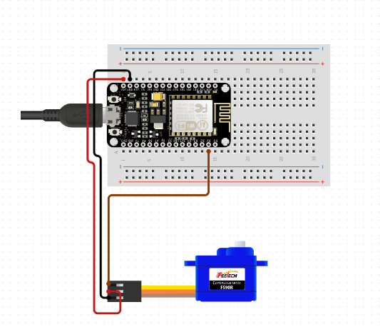

# Smart Door-v1
This project demonstrates how to control a servo motor connected to an ESP32 microcontroller using a web interface. The servo can be moved by entering a correct password on a simple web page hosted by the ESP32.

## Features

- WiFi connectivity
- Local web server
- Password-protected servo control
- Servo moves from 0 to 90 degrees when the correct password is entered
- Automatically closes back to 0 degrees after 5 seconds

## Hardware Requirements

- ESP32 development board
- Servo motor
- Jumper wires
- Power supply for ESP32 and servo

## Software Requirements

- Arduino IDE
- ESP32 board support for Arduino IDE
- Required libraries:
  - WiFi
  - WebServer
  - ESP32Servo

## Circuit Connections

Refer to the  file in this repository for a visual representation of the connections.

1. Connect the servo's signal wire to GPIO 13 on the ESP32.
2. Connect the servo's power wire to the 5V output of the ESP32.
3. Connect the servo's ground wire to the GND of the ESP32.

## Installation

1. Clone this repository or download the source code.
2. Open the Arduino IDE and install the required libraries.
3. Open the `esp32_2.ino` file.
4. Modify the following variables in the code:
   - `wifi`: Your WiFi network name
   - `password`: Your WiFi password
   - `correctPassword`: The password to control the servo (default is "open@123")
5. Select the correct board and port in the Arduino IDE.
6. Upload the code to your ESP32.

## Usage

1. Power on your ESP32.
2. Open the Serial Monitor in Arduino IDE to view the ESP32's IP address.
3. Connect to the same WiFi network as your ESP32.
4. Open a web browser and enter the IP address of your ESP32.
5. You will see a simple web page with a password input field.
6. Enter the correct password (default: "open@123") and click "Move Servo".
7. If the password is correct, the servo will move from 0 to 90 degrees.
8. After 5 seconds, the servo will automatically move back to 0 degrees.

## Customization

- To change the servo pin, modify the `servoPin` variable in the code.
- To adjust the servo's range of motion, modify the values in the `myservo.write()` function calls.
- To change the password, modify the `correctPassword` variable.
- To adjust the time before the servo closes, modify the `delay(5000)` value in the `handleMove()` function.

## Troubleshooting

- If you're having trouble connecting to WiFi, double-check your SSID and password in the code.
- If the servo isn't moving, ensure it's connected to the correct pin and that the ESP32 is receiving adequate power.
- If you can't access the web interface, verify that your computer is on the same network as the ESP32 and that you're using the correct IP address.

## Contributing

Contributions to this project are welcome. Please feel free to submit a Pull Request.

## License

This project is open source and available under the [MIT License](LICENSE).

## Disclaimer

This project is for educational purposes only. Implement proper security measures before using this in any practical application.
